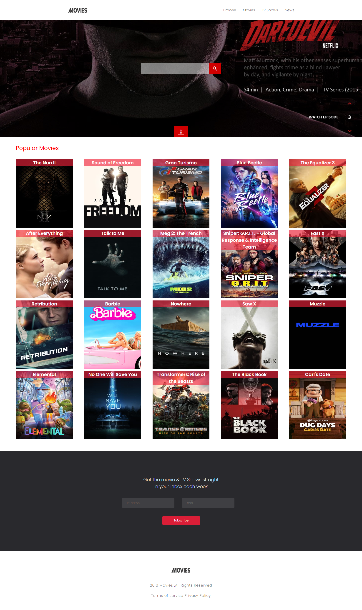
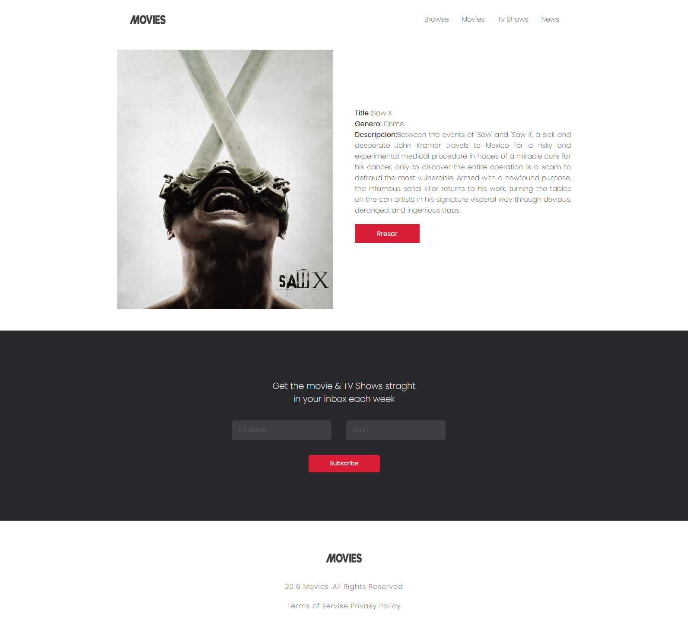

# Movies 

Esta página web dinámica fue creada con  de React y las bibliotecas esenciales como React DOM, useState y useEffect. Utilizamos React Router para gestionar 
las rutas, lo que significa que puedes navegar fácilmente por diferentes secciones de nuestro sitio.

[API](https://movies-reacts.netlify.app/)
[Movies](https://www.themoviedb.org/)

Esta página se conecta directamente a la API de The Movie Database (TMDb)

